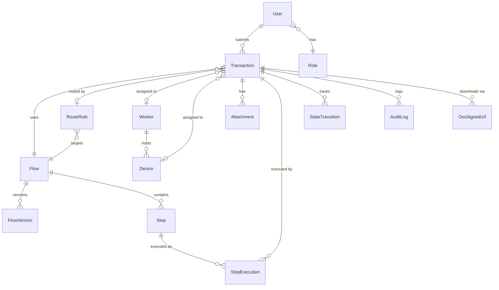

# 3IS-Auto-App 产品需求说明书（PRD）

## 文档信息

| 字段 | 内容 |
|------|------|
| 产品名称 | 3IS-Auto-App（车险保单自动生成 RPA 系统） |
| 文档版本 | V1.1 |
| 创建日期 | 2026-06-02 |
| 最近更新 | 2026-06-03 |
| 文档状态 | Review |

**文档状态机：** `Draft` → `Review` → `Approved` → `Frozen`。任何重大修订必须先回退到 `Draft`，再走一轮同行评审。当前状态为 `Review`，等待业务方、合规方、运维方三方签字后进入 `Approved`。

### 修订记录

| 版本 | 日期 | 修订内容 | 作者 | 评审人 |
|------|------|----------|------|--------|
| V1.0 | 2026-06-02 | 初始版本 | - | - |
| V1.1 | 2026-06-03 | 应用 2026-06-03 共识会 7 项决议 + review 8 处小修 + 4 个架构级替代方案 + 10 个缺失章节初稿 | office-hours | 待签 |

### 术语表

| 术语 | 定义 |
|------|------|
| Transaction | 一次完整的保单录入事务，从资料提交到结果回传的全过程。**业务类型（NEW/RENEWAL）由用户在 Web/API 提交时显式指定**，错误指定由用户承担。 |
| Worker | 安装在桌面端的客户端代理，负责接收调度指令并编排 RPA 执行。**Worker 不再持有影像字节流**，仅做指令中转与编排。 |
| Device | 挂载在 Worker 上的 Android 设备，执行实际的保单录入操作，并独立完成影像文件下载。 |
| Flow | 一个完整的 RPA 流程定义，由多个有序 Step 组成 |
| FlowVersion | Flow 的版本记录，包含脚本包和参数，支持多版本共存与回滚 |
| Step | Flow 中的单个操作步骤，如"打开APP"、"填写表单"、"上传照片" |
| CONFIRM Step | **DEPRECATED**（V1.1 起）。原"用户确认"步骤已废止，由"全自动 + 异步审计"取代。原 StepExecution 中相关字段保留但标 DEPRECATED。 |
| DLQ | Dead Letter Queue，死信队列，用于隔离连续失败的事务 |
| ATT | Average Transaction Time，事务平均执行时长（**仅指 RUNNING 阶段**，不含用户等待） |
| SN/UDID | Android 设备序列号/唯一设备标识 |
| Attachment | 事务关联的影像文件，数量不限，用户可自由上传 |
| SLB/CLB | 云负载均衡服务（阿里云 SLB / 腾讯云 CLB） |
| OSS/COS | 云对象存储服务（阿里云 OSS / 腾讯云 COS） |
| OssSignedUrl | **新增（V1.1）**。OSS 对象的临时签名 URL，TTL 5 分钟，供 Device 直连下载。生成后由 Backend 通过 API 下发，不经 Worker 中转。 |
| KMS | **新增（V1.1）**。Key Management Service，密钥管理服务。手机号/身份证号等敏感字段加密密钥由 KMS 托管，权限按角色隔离。 |
| RedisStream | **新增（V1.1）**。基于 Redis Stream + Consumer Group 的任务队列。**MVP 必需**，替代原"DB 轮询"作为唯一调度方案。 |
| DPoP | **新增（V1.1）**。Data Principal rights，数据主体权利。PIPL 规定的数据主体查询/更正/删除/导出权利。 |

---

## 1. 产品概述

### 1.1 背景

车险投保流程涉及大量影像资料的人工录入（身份证、行驶证、合格证、发票等），耗时长、易出错、人力成本高。

### 1.2 目标

构建分布式、高可用的 RPA 编排平台，实现投保资料的自动化录入与处理，覆盖新保单和续保单两种场景。

### 1.3 价值主张

- 将单笔保单录入时间从人工 15-20 分钟降至自动化 **3-5 分钟**
- 消除人工录入的格式错误和遗漏
- 支持多设备并行处理，线性扩展吞吐量
- 全流程可审计、可追溯
- **V1.1 重要假设：** "3-5 分钟" **仅指 RUNNING 阶段（自动化执行时间）**，**不含**任何用户等待时间。原 V1.0 中的 CONFIRM Step（最长 30 分钟确认等待）已在 V1.1 移除，改为"全自动 + 异步审计"模式。

### 1.4 范围边界

| In Scope | Out of Scope |
|----------|-------------|
| 新保单/续保单的路由分发 | 保单核保与定价逻辑 |
| 影像资料的上传、校验、分发 | 保险公司核心业务系统 |
| 多设备集群调度与负载均衡 | OCR 识别能力（假设外部服务提供，**V1.x 阶段不实现**） |
| RPA 流程编排与步骤级重试 | iOS 设备支持（未来扩展） |
| 全链路状态监控与审计日志 | 支付/出单环节 |
| **业务类型的提交时指定（V1.1 明确）** | **业务类型的智能识别（V2.x 规划）** |

**V1.1 范围说明。** 业务类型（NEW/RENEWAL）由用户在 Web/API 提交事务时显式指定，系统按配置规则路由到对应 Flow。V1.x 不实现自动识别能力（依赖 OCR 等外部服务）。V2.x 规划智能识别能力。

---

## 2. 用户角色与权限

### 2.1 角色定义

| 角色 | 描述 | 核心操作 |
|------|------|----------|
| 销售人员 | 提交投保资料的业务人员 | 提交保单资料（Web/API）、查看**自有**事务状态 |
| 运维管理员 | 监控系统运行状态的运维人员 | 查看 Dashboard、管理设备池、处理 DLQ 事务 |
| 系统管理员 | 系统配置与权限管理 | 管理用户/角色、配置校验规则、管理 Flow 定义 |
| Worker 节点 | 桌面端客户端代理（系统角色） | 注册/心跳、接收任务、编排 RPA 执行、上报结果 |
| Android 设备 | 移动端执行代理（系统角色） | 下载影像资料（**V1.1 起直连 OSS 签名 URL**）、执行 RPA 脚本、上报执行状态 |
| **数据主体（V1.1 新增）** | 自然人/投保人 | 通过 DPoP API 查询/更正/删除/导出自身数据 |

### 2.2 权限矩阵

| 操作 | 销售人员 | 运维管理员 | 系统管理员 | Worker | Device | 数据主体 |
|------|:--------:|:----------:|:----------:|:------:|:------:|:--------:|
| 提交保单资料 | Y | Y | Y | - | - | - |
| 查看事务状态（**自有**） | Y | - | - | - | - | - |
| 查看所有事务 | - | Y | Y | - | - | - |
| 管理设备池 | - | Y | Y | - | - | - |
| 处理 DLQ 事务 | - | Y | Y | - | - | - |
| 管理用户/角色 | - | - | Y | - | - | - |
| 配置校验规则 | - | - | Y | - | - | - |
| 管理 Flow 定义 | - | - | Y | - | - | - |
| 注册/心跳 | - | - | - | Y | - | - |
| 接收/执行任务 | - | - | - | Y | Y | - |
| 下载影像资料 | - | - | - | - | Y | - |
| 查看 Dashboard | - | Y | Y | - | - | - |
| **行使 DPoP 权利（V1.1）** | - | - | Y | - | - | Y |

**行级权限说明（V1.1 新增）。** "查看事务状态"在销售角色下需做行级过滤：销售只能查看 `submitted_by = 当前用户 User ID` 的事务。运维/管理员可查看全部。**禁止**通过 API 参数绕过行级过滤（需对 `submitted_by` 字段做服务端强制覆盖）。

### 2.5 数据合规与隐私（V1.1 新增）

车险影像 + 身份证 + 手机号属于**敏感个人信息**（PIPL 第二十四条），本节明确合规要求。

| 合规章节 | 要求 | 实施要点 |
|----------|------|----------|
| **PIPL 第二十四条** | 处理敏感个人信息需取得单独同意 | 在 Web/API 提交端增加"单独同意"勾选，未勾选拒绝提交 |
| **KMS 密钥管理** | 加密密钥不可硬编码、不可由开发人员持有 | 手机号、身份证号 AES-256 密钥由 KMS 托管；KMS IAM 权限按角色隔离；密钥轮转周期 ≤90 天 |
| **OSS 地域约束** | 数据不出境、客户允许的地域范围 | OSS 桶固定在客户指定地域（默认华东 1 / 华北 2），**禁止**跨地域复制到非白名单区域 |
| **《保险法》第二十一条** | 投保数据至少保存 10 年 | Transaction、Attachment 元数据保存期 ≥10 年；影像文件保存期由业务方定（参考区间 3-10 年） |
| **DPoP 数据主体权利** | 查询 / 更正 / 删除 / 导出 | 提供 `POST /api/v1/dpop/{action}` API；删除采用软删除（标记 `dpop_deleted_at`），不物理删除；导出采用打包下载 |
| **审计日志保留** | 合规审查可还原 | 审计日志保留期 ≥180 天（PIPL 推荐），与保险数据保留期分别管理 |

**分阶段策略（V1.1 共识会决议 P5）。**
- **MVP（V1.1）覆盖：** PIPL 第二十四条（单独同意）、KMS 密钥管理、OSS 地域约束、审计日志 180 天
- **中期（V1.2-V1.3）补：** 《保险法》10 年保存、DPoP 完整接口、保险法对应的存储架构变动

**数据加密策略。**
- 传输：全链路 TLS 1.2+
- 存储：手机号、身份证号 AES-256（密钥 KMS 托管）；其他字段明文
- API 响应：脱敏显示（手机号 `138****1234`，身份证号 `310***********1234`）
- 日志：所有结构化日志自动脱敏，禁止打印完整手机号/身份证号

---

## 3. 业务流程

### 3.1 主流程（端到端，V1.1 全自动模式）

```
销售人员提交资料(指定业务类型) → [事务接入] → 智能路由(按权重) → Schema校验
    → 生成Transaction ID → [调度中心] → 选择Worker+Device
    → 状态: DISPATCHED → Worker接收任务 → 调用OSS签名URL API获取下载链接
    → Worker下发下载链接给Device → Device直连OSS下载影像
    → 状态: DOWNLOADING → 下载完成 → 状态: RUNNING
    → RPA脚本执行(多Step) → 执行完成 → 结果回传
    → 状态: SUCCESS/FAIL → 失败进DLQ运维兜底 → 销售人员查看结果
```

**V1.1 关键变化。**
- 业务类型由用户提交时显式指定，系统不再"智能识别"
- Device 直连 OSS 签名 URL（Worker 不再中转文件字节流）
- 全自动执行：失败进 DLQ 运维兜底，**不**在流程中插入用户确认环节

### 3.2 新保单流程

输入资料：影像文件（不限制数量和张数，可能包含身份证、车辆合格证、发票等）、手机号码、业务类型=NEW

```
提交资料(业务类型=NEW) → 校验(至少1份影像+手机号) → 路由至新保Flow
→ Step1: 打开保险APP → Step2: 选择新保入口
→ Step3: 填写手机号 → Step4~StepN: 逐张上传影像资料
→ StepN+1: 提交表单 → 状态: SUCCESS
```

**V1.1 移除：** StepN+2 截图等待用户确认(CONFIRM)、StepN+3 确认后提交。

### 3.3 续保单流程

输入资料：影像文件（不限制数量和张数，可能包含身份证、行驶证等）、手机号码、业务类型=RENEWAL

```
提交资料(业务类型=RENEWAL) → 校验(至少1份影像+手机号) → 路由至续保Flow
→ Step1: 打开保险APP → Step2: 选择续保入口
→ Step3: 填写手机号 → Step4~StepN: 逐张上传影像资料
→ StepN+1: 提交表单 → 状态: SUCCESS
```

**V1.1 移除：** StepN+2 截图等待用户确认(CONFIRM)、StepN+3 确认后提交。

### 3.4 状态机（V1.1 简化）

```
PENDING → DISPATCHED → DOWNLOADING → RUNNING → SUCCESS
                                              → FAIL
                                                  → RETRY → RUNNING (最多N次)
                                                  → DLQ (终态失败，需人工介入)
```

| 状态 | 触发条件 | 说明 |
|------|----------|------|
| PENDING | 事务创建，校验通过 | 等待调度 |
| DISPATCHED | 调度中心分配 Worker+Device | 任务已下发 |
| DOWNLOADING | Device 开始下载影像资料 | 资料传输中 |
| RUNNING | 下载完成，RPA 脚本开始执行 | 自动化操作中 |
| SUCCESS | RPA 执行完成，结果验证通过 | 正常终态 |
| FAIL | 执行异常/超时/校验失败 | 可重试 |
| DLQ | 连续失败超过阈值或事务级超时 | 死信队列，需人工介入 |

**V1.1 移除状态：** `WAITING_CONFIRM`。原 CONFIRM 流程已废止，改为"全自动 + 异步审计"（失败进 DLQ 运维处理）。

**V1.1 新增触发：** 事务级超时（30 分钟未到终态）强制进 DLQ，详见 §3.5。

### 3.5 异常分支

- **文件下载失败**：Device 侧断点续传，超过重试次数后状态置为 FAIL
- **RPA 步骤失败**：Step 级重试（按 Retry Policy），全部重试耗尽后事务 FAIL
- **Worker 宕机**：服务端心跳超时检测，事务回退至 PENDING 重新调度
- **Device 离线**：调度中心跳过该设备，重新选择可用设备
- **事务级超时（V1.1 新增）**：单事务从 PENDING 起超过 30 分钟（可配置）未到达终态（SUCCESS/FAIL），强制置为 DLQ；防止事务在 RUNNING 状态挂死占用设备
- **OSS 签名 URL 过期**：Device 端发起续签请求（FR-MOB-006）；过期超过 3 次该事务置为 FAIL

### 3.6 业务连续性（BCP，V1.1 新增）

| 故障场景 | 业务影响 | 恢复顺序 |
|----------|----------|----------|
| 单 Worker 宕机 | 该 Worker 上的事务回退 PENDING 重新调度 | 自动（≤60s） |
| 站点全断（网络/电力） | 该站点所有 Worker 不可用，事务全量回退 PENDING | 自动，调度中心跳过该站点 |
| 云端 Backend 单实例故障 | SLB 自动切流到健康实例 | 自动（≤30s） |
| 云端 Backend 全部故障 | 销售可继续提交（写入 OSS 直传通道），Worker 任务排队等待恢复 | **半自动**：运维确认后人工恢复 |
| 数据库主从切换 | 短时（≤30s）写入失败，事务提交重试 | 自动 |
| OSS 不可用 | 影像上传和下载失败，所有事务 FAIL | **半自动**：运维确认后切备用 OSS 或重试 |
| KMS 不可用 | 敏感字段加解密失败，所有事务 FAIL | **半自动**：运维确认后重启 KMS Client |

**断电恢复顺序（站点侧）：** Worker 启动 → 自动注册 → 拉取最新 Flow 脚本 → 拉取待执行事务 → 恢复执行（Device 状态需重新校验）。预期从断电到恢复 ≤ 5 分钟（视事务积压量）。

---

## 4. 功能需求

### 4.1 服务端功能（FR-SVR-xxx）

#### FR-SVR-001 销售人员 Web 门户提交

| 字段 | 内容 |
|------|------|
| 描述 | 销售人员通过 Web 表单手动提交单笔保单资料 |
| 输入 | 业务类型（新保/续保）、手机号、身份证号、影像文件（image/pdf，数量不限） |
| 输出 | Transaction ID、提交时间戳、初始状态 PENDING |
| 规则 | 文件大小单张 ≤10MB；图片格式 jpg/png/jpeg；PDF 单文件 ≤20MB |
| 验收 | 提交成功返回 Transaction ID；缺失必填项返回 400 错误且提示具体字段 |

#### FR-SVR-002 REST API 批量推送

| 字段 | 内容 |
|------|------|
| 描述 | 第三方系统通过 REST API 批量推送保险人信息 |
| 输入 | 数组形式的保单数据（每条含业务类型、客户信息、影像URL或base64） |
| 输出 | 每条记录对应的 Transaction ID 列表、失败明细 |
| 规则 | 单次批量 ≤100 条；API 需携带 Bearer Token；幂等性通过外部业务ID保障 |
| 验收 | 批量提交支持部分成功；失败条目返回原因码；重复 externalId 不重复创建事务 |

#### FR-SVR-003 智能业务路由

| 字段 | 内容 |
|------|------|
| 描述 | 根据事务类型和路由规则，将事务分发至对应 Flow 执行，支持按百分比分配 |
| 输入 | 事务类型（**用户提交时显式指定**：NEW 或 RENEWAL）、已配置的路由规则 |
| 输出 | 路由后的事务（绑定对应 Flow ID） |
| 规则 | 每个事务类型可配置多个路由规则（如 NEW 下 Flow A 占 70%、Flow B 占 30%）；路由规则按权重百分比随机分配；支持按 Flow 版本分配；**事务类型由用户在提交时显式指定，错误指定由用户承担，系统不做自动识别** |
| 验收 | 用户提交时指定事务类型后，系统正确分配对应 Flow；权重分配在大量事务下符合配置比例（偏差 ≤5%） |

#### FR-SVR-004 Schema 校验

| 字段 | 内容 |
|------|------|
| 描述 | 根据业务类型动态加载 JSON Schema 校验输入数据 |
| 输入 | 事务数据、对应 Schema 定义 |
| 输出 | 校验通过/失败结果、失败明细 |
| 规则 | Schema 校验字段完整性（手机号格式、文件格式合法性），不校验文件数量和具体类型组合；Schema 配置化（YAML/JSON），支持热更新；校验失败不消耗调度资源 |
| 验收 | 校验失败的事务不进入调度队列；规则变更无需重启服务 |

#### FR-SVR-005 Transaction ID 生成

| 字段 | 内容 |
|------|------|
| 描述 | 为每个事务生成全局唯一 ID，贯穿所有服务调用 |
| 输入 | 无（系统自动生成） |
| 输出 | 全局唯一 ID（UUID v7 或 Snowflake ID） |
| 规则 | 单调递增；包含时间戳信息；长度 ≤32 字符 |
| 验收 | 100 万次生成无冲突；分布式环境下唯一性保障 |

#### FR-SVR-006 智能负载均衡调度

| 字段 | 内容 |
|------|------|
| 描述 | 调度中心根据 Worker 性能和设备空闲率分配任务 |
| 输入 | 待调度事务、Worker 列表（含CPU/内存/挂载设备数）、Device 状态 |
| 输出 | 分配结果（Transaction ID → Worker ID + Device ID） |
| 规则 | 算法：最小连接数 + 权重轮询；不分配给负载>80%的 Worker |
| 验收 | 1000 笔事务调度后，Worker 间负载偏差 ≤15% |

#### FR-SVR-007 设备亲和性策略

| 字段 | 内容 |
|------|------|
| 描述 | 同一事务的所有步骤优先在固定设备上执行 |
| 输入 | Transaction ID、绑定的 Device ID |
| 输出 | 后续 Step 调度时优先使用同一 Device |
| 规则 | 绑定设备宕机时才允许重新调度；重新调度时从 Step1 开始 |
| 验收 | 正常情况下事务全程不切换设备；设备故障切换后状态正确重置 |

#### FR-SVR-008 状态机管理

| 字段 | 内容 |
|------|------|
| 描述 | 维护事务状态强一致性流转，记录每次变更 |
| 输入 | 状态变更事件（来自 Worker/Device 上报） |
| 输出 | 持久化的状态变更记录（含时间戳、操作者、原状态、新状态） |
| 规则 | 禁止非法状态跳转（如 PENDING 直接到 SUCCESS）；变更操作幂等 |
| 验收 | 状态流转 100% 符合定义；非法变更被拒绝并记录告警 |

#### FR-SVR-009 客户端注册中心

| 字段 | 内容 |
|------|------|
| 描述 | 管理 Worker 节点的注册、心跳、版本、能力标签 |
| 输入 | Worker 注册请求（含本机指纹、版本号、Tag）、心跳包 |
| 输出 | 注册确认、Worker 列表查询接口 |
| 规则 | 心跳周期 ≤30s；连续 3 次未收到心跳标记为 OFFLINE |
| 验收 | Worker 上下线状态实时更新；OFFLINE 后任务自动回收 |

#### FR-SVR-010 设备池管理

| 字段 | 内容 |
|------|------|
| 描述 | 维护 Android 设备的唯一标识、在线状态、占用情况 |
| 输入 | Worker 上报的设备列表（含 SN/UDID、电量、存储） |
| 输出 | 设备池视图（含状态、当前事务） |
| 规则 | 同一 SN 全系统唯一；支持手动禁用设备 |
| 验收 | 设备状态变更延迟 ≤5s；禁用设备不再被调度 |

#### FR-SVR-011 审计日志

| 字段 | 内容 |
|------|------|
| 描述 | 全量记录事务操作、异常堆栈、调度决策 |
| 输入 | 系统各模块的操作事件 |
| 输出 | 结构化日志（JSON 格式），可检索、可导出 |
| 规则 | 日志保留 ≥180 天；敏感字段脱敏（身份证号、手机号） |
| 验收 | 任一事务的完整生命周期可还原；日志查询响应 ≤2s |

#### FR-SVR-012 Dashboard 监控

| 字段 | 内容 |
|------|------|
| 描述 | 提供可视化监控看板 |
| 输入 | 系统运行数据 |
| 输出 | 实时展示：事务积压量、设备在线率、脚本成功率、ATT |
| 规则 | 数据刷新间隔 ≤30s；支持按时间范围/Worker/Device 筛选 |
| 验收 | 关键指标可视化展示；支持告警阈值配置 |

#### FR-SVR-013 死信队列处理

| 字段 | 内容 |
|------|------|
| 描述 | 隔离连续失败的事务，支持人工介入 |
| 输入 | 连续失败次数 ≥N（可配置，默认 3 次）的事务 |
| 输出 | DLQ 列表、人工重试/丢弃接口 |
| 规则 | DLQ 事务不自动重试；运维可查看失败原因、重新提交或归档 |
| 验收 | DLQ 事务可单独管理；重新提交后回到正常流程 |

#### FR-SVR-014 用户确认通知

**【DEPRECATED，V1.1 起】** 已被全自动模式取代，移除相关实现。保留编号占位以兼容历史引用。

#### FR-SVR-015 用户确认回调

**【DEPRECATED，V1.1 起】** 同上，移除实现。

#### FR-SVR-016 流程脚本上传

| 字段 | 内容 |
|------|------|
| 描述 | 管理员通过 Web 门户或 API 上传 Airtest Python 脚本包（.zip/.py），并设置流程参数 |
| 输入 | Flow ID、脚本包文件、流程参数（JSON，如 APP 包名、等待超时等）、版本说明 |
| 输出 | 新版本号、脚本包存储路径 |
| 规则 | 脚本包单文件 ≤50MB；仅允许 .py/.zip 格式；上传时自动进行语法校验（`python -m py_compile`）；参数与 Schema 校验一致；每次上传自动递增版本号 |
| 验收 | 上传成功返回版本号；语法错误脚本拒绝上传并返回错误行号；参数缺失时提示补全 |

#### FR-SVR-017 流程版本管理

| 字段 | 内容 |
|------|------|
| 描述 | 管理 Flow 的多版本生命周期，支持发布、回滚、停用 |
| 输入 | Flow ID、版本号、操作类型（publish/rollback/deprecate） |
| 输出 | 操作结果、当前生效版本号 |
| 规则 | 同一 Flow 同时仅一个"已发布"版本；回滚操作将指定旧版本重新设为已发布；已停用版本不再分发给 Worker；版本号格式 semver（如 1.0.0 → 1.0.1） |
| 验收 | 发布后 Worker 可拉取到新版本；回滚后生效版本正确切换；停用版本不被调度使用 |

#### FR-SVR-018 异常截图推送（V1.1 新增）

| 字段 | 内容 |
|------|------|
| 描述 | RPA 执行失败时，将失败现场截图推送至运维 Dashboard，供事后审计 |
| 输入 | Transaction ID、Step execution ID、截图 URL、失败原因 |
| 输出 | 推送确认 |
| 规则 | 失败重试耗尽后自动推送；截图保留 30 天；推送去重（同一事务同一步骤失败只推一次） |
| 验收 | 失败事务在 Dashboard 30s 内可见；运维可按事务 ID 还原失败现场 |

#### FR-SVR-019 失败回滚（V1.1 新增）

| 字段 | 内容 |
|------|------|
| 描述 | 事务执行失败时，触发关联资源的回滚操作（如已上传的影像、已填写的表单） |
| 输入 | Transaction ID、失败 Step ID、已操作资源列表 |
| 输出 | 回滚结果 |
| 规则 | 回滚采用"软回滚"（标记 + 清理任务），不阻塞当前流程；回滚失败进人工队列 |
| 验收 | 失败事务的关联影像在 5 分钟内被清理；Dashboard 显示回滚状态 |

#### FR-SVR-020 异步审计日志（V1.1 新增）

| 字段 | 内容 |
|------|------|
| 描述 | 全量记录事务操作、状态变更、调度决策，异步写入审计存储 |
| 输入 | 系统各模块的操作事件（结构化事件流） |
| 输出 | 持久化的审计日志（JSON 格式） |
| 规则 | 异步写入（不阻塞主流程，事件丢失容忍度 ≤1%）；日志保留 ≥180 天；敏感字段自动脱敏 |
| 验收 | 任一事务的完整生命周期可还原；日志查询响应 ≤2s；事件丢失率 < 1% |

#### FR-SVR-021 全自动模式开关（V1.1 新增）

| 字段 | 内容 |
|------|------|
| 描述 | 系统提供"全自动模式"开关，可在 Flow 级别启用/禁用 |
| 输入 | Flow ID、开关状态（enabled/disabled） |
| 输出 | 配置结果 |
| 规则 | 默认全部 enabled；禁用后该 Flow 的事务仍可执行但失败率高时**不**自动重试，直接进 DLQ（人工兜底） |
| 验收 | 开关变更实时生效；配置变更记录审计日志 |

### 4.2 客户端功能（FR-CLI-xxx）

#### FR-CLI-001 自动注册

| 字段 | 内容 |
|------|------|
| 描述 | 客户端启动时向服务端注册 |
| 输入 | 本机指纹（MAC/主机名/CPU序列号哈希）、版本号、已连接 Android 设备列表 |
| 输出 | 服务端返回的 Worker ID、Token |
| 规则 | Token 有效期 24h，自动续期；注册失败重试 3 次后退出 |
| 验收 | 首次启动注册成功；重启后保持原 Worker ID |

#### FR-CLI-002 状态同步

| 字段 | 内容 |
|------|------|
| 描述 | 周期性上报本机及挂载设备的健康度 |
| 输入 | 本机 CPU/内存/磁盘、设备电量/存储/锁屏状态 |
| 输出 | 心跳包（含上述指标） |
| 规则 | 心跳间隔 30s；指标异常（如设备电量<20%）触发告警；心跳包中携带本地已缓存 Flow 版本信息，服务端据此判断是否有新版本需要下载 |
| 验收 | 服务端 Dashboard 实时反映客户端状态；服务端响应心跳中携带"有更新"标记，Worker 据此触发脚本下载 |

#### FR-CLI-003 指令监听

| 字段 | 内容 |
|------|------|
| 描述 | 实时接收服务端下发的任务指令 |
| 输入 | 服务端推送的任务消息 |
| 输出 | 任务接收确认 |
| 规则 | 优先使用 WebSocket；断线降级为长轮询；断线自动重连 |
| 验收 | 任务下发延迟 ≤1s；断网恢复后自动重新订阅 |

#### FR-CLI-004 数据拉取

**【DEPRECATED，V1.1 起】** 影像文件下载已迁移至 Device 直连 OSS 签名 URL（FR-MOB-002 / FR-MOB-006）。Worker 不再持有影像字节流。本条仅作为历史引用保留，新实现不得参考。

#### FR-CLI-004-Note（V1.1 替代方案）

V1.1 起，Worker 接到任务后只做以下动作：
1. 调用 `POST /api/v1/transactions/{id}/oss-urls` 获取 OSS 签名 URL 列表（详见 §6.2.2）
2. 通过 Socket 将 URL 列表下发给 Device
3. 等待 Device 上报下载完成事件，进入 RUNNING 状态

Worker **不**再下载文件到本地沙箱、不再 AES-256 加密影像、不再通过 Socket 推送给 Device。

#### FR-CLI-005 RPA 编排器

| 字段 | 内容 |
|------|------|
| 描述 | 编排 Flow → Steps 的执行流程 |
| 输入 | Flow 定义（含 Steps 顺序、参数、Retry Policy） |
| 输出 | 各 Step 的执行结果、最终事务结果 |
| 规则 | 支持 Step 级重试（默认 3 次，指数退避）；支持 Step 超时熔断（默认 60s/Step）；**V1.1 移除 CONFIRM Step 特殊处理**（遇到 CONFIRM 类型 Step 直接按普通 Step 执行，依赖 FR-SVR-018 失败截图兜底） |
| 验收 | Flow 按定义顺序执行；任一 Step 失败触发重试；超时不阻塞整体流程；CONFIRM Step 退化为普通 Step 不再暂停 |

#### FR-CLI-006 结果回传

| 字段 | 内容 |
|------|------|
| 描述 | 执行完毕后向服务端上报结果 |
| 输入 | 事务执行结果、截图证据、各 Step 耗时 |
| 输出 | 服务端确认回传 |
| 规则 | 回传失败重试 5 次；截图压缩后上传（JPEG quality 70） |
| 验收 | 服务端可查询到完整执行记录和截图；上报延迟 ≤5s |

#### FR-CLI-007 流程脚本同步

| 字段 | 内容 |
|------|------|
| 描述 | Worker 根据需要从服务端下载有效的 Flow 脚本并本地存储，检测到新版本时提示更新 |
| 输入 | Worker 已注册的 Flow 列表、本地已缓存版本 |
| 输出 | 下载的脚本包、本地存储路径 |
| 规则 | 启动时和服务端校验本地已缓存 Flow 版本；若有新版本则下载并替换本地脚本；本地脚本仅供当前 Worker 使用，目录权限 700；支持增量更新（仅下载版本差异部分）；无新版本时不重复下载 |
| 验收 | 新版本发布后 Worker 在下次心跳前检测到差异；下载完成后本地脚本立即可用；旧版本脚本在更新前保留备份（.bak） |

### 4.3 移动端功能（FR-MOB-xxx）

#### FR-MOB-001 任务监听

| 字段 | 内容 |
|------|------|
| 描述 | Android Agent 监听桌面客户端或服务端的指令 |
| 输入 | 指令消息（Socket/HTTP） |
| 输出 | 指令接收确认 |
| 规则 | 监听端口可配置（默认 8765）；仅接受白名单 IP 连接 |
| 验收 | 指令接收延迟 ≤1s；非白名单连接被拒绝 |

#### FR-MOB-002 文件同步

| 字段 | 内容 |
|------|------|
| 描述 | 根据 Transaction ID 从 **OSS 签名 URL** 下载影像资料（**V1.1 起直连 OSS，不再经 Worker 中转**） |
| 输入 | Transaction ID、OSS 签名 URL 列表（含 MD5） |
| 输出 | 本地指定目录的文件 |
| 规则 | 直连 OSS 签名 URL 下载；支持断点续传；下载完成后做 MD5 校验；存储路径可配置；签名 URL 过期（默认 5min）自动调用续签接口 |
| 验收 | 文件 100% 完整下载；网络中断后可恢复；MD5 不匹配自动重新下载；签名 URL 过期自动续签 ≤3 次 |

#### FR-MOB-003 环境准备

| 字段 | 内容 |
|------|------|
| 描述 | 下载完成后唤醒 RPA 脚本执行环境 |
| 输入 | 下载完成事件 |
| 输出 | 状态上报"就绪"、RPA 脚本启动 |
| 规则 | 唤醒前检查屏幕状态、APP 安装状态 |
| 验收 | 状态变更可被服务端感知；脚本执行环境正确初始化 |

#### FR-MOB-004 沙箱机制

| 字段 | 内容 |
|------|------|
| 描述 | 影像文件仅存储在指定目录，支持目标 APP 访问 |
| 输入 | 文件存储请求 |
| 输出 | 受控目录中的文件 |
| 规则 | 目录权限按 Android 文件系统规范配置；其他应用通过 FileProvider 访问 |
| 验收 | 目标保险 APP 可正常读取；其他应用无权访问 |

#### FR-MOB-005 清理策略

| 字段 | 内容 |
|------|------|
| 描述 | 事务结束（成功或终态失败）后自动清理文件 |
| 输入 | 事务终态事件 |
| 输出 | 文件已删除确认 |
| 规则 | SUCCESS 后立即清理；FAIL 保留 24h 供排查后清理；DLQ 保留 7 天 |
| 验收 | 清理后磁盘空间释放；日志记录清理操作 |

#### FR-MOB-006 OSS 签名 URL 处理与刷新（V1.1 新增）

| 字段 | 内容 |
|------|------|
| 描述 | Device 接收 OSS 签名 URL 列表，下载过程中处理 URL 过期、续签、失败重试 |
| 输入 | OSS 签名 URL 列表（含 TTL、MD5） |
| 输出 | 本地下载完成的文件 |
| 规则 | 签名 URL TTL ≤5min（Backend 控制）；过期前 1min 主动续签；过期后 3 次重试失败该事务置 FAIL；下载全过程通过 §6.2.3 设备接口与 Backend 同步状态 |
| 验收 | 签名 URL 过期自动续签成功；连续 3 次续签失败事务置 FAIL；下载过程 Backend 端状态实时更新 |

---

## 5. 数据模型设计

### 5.1 核心实体清单

| 实体 | 描述 |
|------|------|
| Transaction | 事务主体，记录一次完整保单录入 |
| User | 用户（销售/运维/管理员） |
| Role | 角色与权限 |
| Worker | 桌面客户端节点 |
| Device | Android 设备 |
| Flow | RPA 流程定义 |
| FlowVersion | Flow 的版本记录（含脚本包） |
| Step | Flow 中的步骤定义 |
| StepExecution | Step 执行记录 |
| Attachment | 影像附件 |
| AuditLog | 审计日志 |
| StateTransition | 状态变更记录 |
| RouteRule | 事务类型到 Flow 的路由规则，支持按百分比分配 |
| OssSignedUrl | **V1.1 新增**。OSS 对象临时签名 URL 记录，用于 Device 直连下载 |

### 5.2 实体字段定义

#### Transaction（事务）

| 字段 | 类型 | 说明 |
|------|------|------|
| transaction_id | String(32) PK | 全局唯一 ID |
| external_id | String(64) | 外部业务 ID（幂等用） |
| transaction_type | String(64) | 用户提交时指定的事务类型（如 RENEWAL/NEW），由路由规则映射到 Flow |
| business_type | Enum | NEW（新保）/ RENEWAL（续保）|
| status | Enum | PENDING/DISPATCHED/DOWNLOADING/RUNNING/SUCCESS/FAIL/DLQ |
| customer_phone | String(11) | 手机号（加密存储） |
| customer_id_no | String(18) | 身份证号（加密存储） |
| submitted_by | String | 提交人 User ID |
| submitted_at | DateTime | 提交时间 |
| flow_id | String FK | 关联 Flow |
| worker_id | String FK | 分配的 Worker |
| device_id | String FK | 分配的 Device |
| retry_count | Int | 重试次数 |
| started_at | DateTime | 开始执行时间 |
| finished_at | DateTime | 完成时间 |
| duration_ms | Long | 总耗时（毫秒） |
| failure_reason | Text | 失败原因 |
| ~~callback_url~~ | ~~String(512)~~ | **DEPRECATED (V1.1)**：CONFIRM Step 移除后无意义。保留字段不删除以兼容历史数据。 |

#### User（用户）

| 字段 | 类型 | 说明 |
|------|------|------|
| user_id | String PK | 用户 ID |
| username | String(64) UK | 用户名 |
| password_hash | String | 密码哈希（bcrypt） |
| role_id | String FK | 角色 ID |
| email | String(128) | 邮箱 |
| status | Enum | ACTIVE/DISABLED |
| created_at | DateTime | 创建时间 |

#### Role（角色）

| 字段 | 类型 | 说明 |
|------|------|------|
| role_id | String PK | 角色 ID |
| role_name | String(64) UK | 角色名 |
| permissions | JSON | 权限列表 |

#### Worker（桌面节点）

| 字段 | 类型 | 说明 |
|------|------|------|
| worker_id | String PK | Worker 唯一 ID |
| fingerprint | String(64) UK | 本机指纹哈希 |
| hostname | String | 主机名 |
| ip_address | String | IP 地址 |
| version | String | 客户端版本 |
| tags | JSON | 能力标签 |
| cpu_usage | Float | CPU 使用率 |
| memory_usage | Float | 内存使用率 |
| status | Enum | ONLINE/OFFLINE/BUSY |
| last_heartbeat_at | DateTime | 最后心跳时间 |
| registered_at | DateTime | 注册时间 |

#### Device（Android 设备）

| 字段 | 类型 | 说明 |
|------|------|------|
| device_id | String PK | Device 唯一 ID |
| sn | String(64) UK | 设备 SN/UDID |
| worker_id | String FK | 挂载的 Worker |
| model | String | 设备型号 |
| android_version | String | Android 版本 |
| battery_level | Int | 电量（0-100） |
| storage_free_mb | Int | 剩余存储（MB） |
| screen_locked | Boolean | 是否锁屏 |
| status | Enum | ONLINE/OFFLINE/BUSY/DISABLED |
| current_transaction_id | String | 当前占用事务 |
| last_seen_at | DateTime | 最后一次状态上报时间（**V1.1 新增**，与 Worker 心跳区分，用于独立判断 Device 在线状态） |

#### Flow（流程定义）

| 字段 | 类型 | 说明 |
|------|------|------|
| flow_id | String PK | Flow ID |
| flow_name | String(64) | Flow 名称 |
| business_type | Enum | NEW/RENEWAL |
| current_version | String | 当前已发布版本号（指向 FlowVersion.version） |
| schema | JSON | 输入校验 Schema |
| is_active | Boolean | 是否启用 |
| created_at | DateTime | 创建时间 |

#### FlowVersion（流程版本）

| 字段 | 类型 | 说明 |
|------|------|------|
| version_id | String PK | 版本记录 ID（UUID） |
| flow_id | String FK | 所属 Flow |
| version | String | 版本号（semver，如 1.0.0） |
| script_path | String | 脚本包存储路径（OSS） |
| script_md5 | String(32) | 脚本包 MD5 |
| params_schema | JSON | 流程参数 Schema（描述预期参数结构） |
| params_example | JSON | 参数示例值 |
| changelog | String(512) | 版本变更说明 |
| status | Enum | DRAFT/PUBLISHED/DEPRECATED |
| created_by | String | 创建人 User ID |
| created_at | DateTime | 创建时间 |
| published_at | DateTime | 发布时间（DRAFT 时为空） |

#### Step（步骤定义）

| 字段 | 类型 | 说明 |
|------|------|------|
| step_id | String PK | Step ID |
| flow_id | String FK | 所属 Flow |
| order | Int | 执行顺序 |
| step_name | String(64) | 步骤名称 |
| action_type | Enum | OPEN_APP/INPUT/UPLOAD/CLICK/SCREENSHOT/CONFIRM/WAIT |
| params | JSON | 步骤参数 |
| retry_policy | JSON | 重试策略 |
| timeout_ms | Int | 超时时间 |
| ~~confirm_timeout_ms~~ | ~~Int~~ | **DEPRECATED (V1.1)**：CONFIRM Step 移除后无意义。保留字段不删除以兼容历史数据。 |
| ~~confirm_prompt~~ | ~~String(256)~~ | **DEPRECATED (V1.1)**：同上。 |

#### StepExecution（步骤执行记录）

| 字段 | 类型 | 说明 |
|------|------|------|
| execution_id | String PK | 执行记录 ID |
| transaction_id | String FK | 关联事务 |
| step_id | String FK | 关联 Step |
| attempt | Int | 第几次尝试 |
| status | Enum | RUNNING/SUCCESS/FAIL/TIMEOUT |
| started_at | DateTime | 开始时间 |
| finished_at | DateTime | 结束时间 |
| duration_ms | Long | 耗时 |
| screenshot_url | String | 截图存储路径 |
| error_message | Text | 错误信息 |
| ~~confirm_status~~ | ~~Enum~~ | **DEPRECATED (V1.1)**：PENDING/CONFIRMED/REJECTED/TIMEOUT。CONFIRM Step 移除后无意义。保留字段不删除以兼容历史数据。 |
| ~~confirm_screenshot_url~~ | ~~String~~ | **DEPRECATED (V1.1)**：同上。V1.1 起失败截图统一由 FR-SVR-018 异常截图推送处理。 |
| ~~confirmed_by~~ | ~~String~~ | **DEPRECATED (V1.1)**：同上。 |
| ~~confirmed_at~~ | ~~DateTime~~ | **DEPRECATED (V1.1)**：同上。 |

#### Attachment（附件）

| 字段 | 类型 | 说明 |
|------|------|------|
| attachment_id | String PK | 附件 ID |
| transaction_id | String FK | 关联事务 |
| file_type | Enum | ID_CARD/DRIVING_LICENSE/CERTIFICATE/INVOICE/OTHER |
| description | String(128) | 用户对文件的描述/标签（如"身份证正反面合一"） |
| file_format | Enum | JPG/PNG/PDF |
| file_size | Long | 文件大小（字节） |
| storage_url | String | 服务端存储路径 |
| md5 | String(32) | 文件 MD5 |
| uploaded_at | DateTime | 上传时间 |

#### AuditLog（审计日志）

| 字段 | 类型 | 说明 |
|------|------|------|
| log_id | String PK | 日志 ID |
| transaction_id | String FK | 关联事务（可空） |
| actor_type | Enum | USER/WORKER/DEVICE/SYSTEM |
| actor_id | String | 操作者 ID |
| action | String(64) | 操作类型 |
| target | String | 操作对象 |
| details | JSON | 详细信息 |
| created_at | DateTime | 时间戳 |

#### RouteRule（路由规则）

| 字段 | 类型 | 说明 |
|------|------|------|
| rule_id | String PK | 规则 ID |
| transaction_type | String(64) | 事务类型（如 RENEWAL/NEW），与用户提交时一致 |
| flow_id | String FK | 分配的 Flow |
| flow_version | String | 指定 Flow 版本（为空则使用 current_version） |
| weight | Int | 权重百分比（1-100），同 transaction_type 下所有规则权重之和应为 100 |
| ~~priority~~ | ~~Int~~ | **DEPRECATED (V1.1)**：V1.0 用 priority 排序再按 weight 分配，逻辑重复。V1.1 简化为仅按 weight 随机分配，不再需要 priority 字段。保留字段不删除以兼容历史数据。 |
| is_active | Boolean | 是否启用 |
| created_by | String | 创建人 User ID |
| created_at | DateTime | 创建时间 |
| updated_at | DateTime | 更新时间 |

#### StateTransition（状态变更记录）

| 字段 | 类型 | 说明 |
|------|------|------|
| transition_id | String PK | 变更 ID |
| transaction_id | String FK | 关联事务 |
| from_state | Enum | 原状态 |
| to_state | Enum | 新状态 |
| triggered_by | String | 触发者 |
| reason | String | 变更原因 |
| occurred_at | DateTime | 变更时间 |

#### OssSignedUrl（V1.1 新增）

| 字段 | 类型 | 说明 |
|------|------|------|
| signed_url_id | String PK | 签名 URL 记录 ID（UUID） |
| transaction_id | String FK | 关联事务 |
| attachment_id | String FK | 关联附件（指向具体 OSS 对象） |
| url | String(1024) | OSS 签名 URL（含签名参数） |
| expires_at | DateTime | 过期时间（生成时 + 5min） |
| created_at | DateTime | 创建时间 |
| consumed_at | DateTime | 消费时间（Device 下载完成时间，可空） |
| refresh_count | Int | 续签次数（默认 0，超过 3 该事务置 FAIL） |

### 5.3 实体关系图

```
User ──N:1── Role
Transaction ──N:1── User (submitted_by)
Transaction ──N:1── Flow
Transaction ──N:1── RouteRule (via transaction_type)
RouteRule ──N:1── Flow
Transaction ──N:1── Worker (可空)
Transaction ──N:1── Device (可空)
Transaction ──1:N── Attachment
Transaction ──1:N── StepExecution
Transaction ──1:N── StateTransition
Transaction ──1:N── AuditLog
Transaction ──1:N── OssSignedUrl (V1.1 新增)
Flow ──1:N── FlowVersion
Flow ──1:N── Step
FlowVersion ──1:N── Step (via current_version binding on Step.flow_id+version)
StepExecution ──N:1── Step
Worker ──1:N── Device
```

**Mermaid 渲染版本（V1.1 新增，推荐使用）**：



**V1.1 关系变化。**
- 新增 `Transaction ──1:N── OssSignedUrl`：每个事务可对应多个签名 URL（多文件场景）
- 原 `StepExecution ──N:1── Step` 保持不变（CONFIRM Step 字段在 Step 表中保留 DEPRECATED 标记）

---

## 6. 接口概要设计

### 6.1 接口分类

| 分类 | 用途 | 协议 |
|------|------|------|
| 业务接口 | 销售提交、查询事务 | HTTPS REST |
| 调度接口 | Worker 注册、心跳、任务领取 | HTTPS REST + WebSocket |
| 设备接口 | Device 文件下载、状态上报 | HTTPS REST |
| 管理接口 | 用户/角色/Flow/路由规则管理 | HTTPS REST |
| 监控接口 | Dashboard 数据查询 | HTTPS REST |

### 6.2 REST API 清单

#### 6.2.1 业务接口

| Method | Path | 描述 | 鉴权 |
|--------|------|------|------|
| POST | /api/v1/transactions | 单笔提交保单 | User Token |
| POST | /api/v1/transactions/batch | 批量提交保单 | API Token |
| GET | /api/v1/transactions/{id} | 查询事务详情 | User Token |
| GET | /api/v1/transactions | 查询事务列表（含筛选） | User Token |
| POST | /api/v1/transactions/{id}/retry | 手动重试事务（DLQ）| Admin Token |
| ~~GET \| /api/v1/transactions/{id}/confirms~~ | ~~查询待确认截图列表~~ | **DEPRECATED (V1.1)**：CONFIRM 移除 |
| ~~POST \| /api/v1/transactions/{id}/confirms/{step_exec_id}~~ | ~~用户确认/拒绝截图~~ | **DEPRECATED (V1.1)**：CONFIRM 移除 |
| **POST** | **/api/v1/transactions/{id}/oss-urls (V1.1 新增)** | **生成 OSS 签名 URL 列表** | **Worker Token** |
| **POST** | **/api/v1/oss-urls/{signed_url_id}/refresh (V1.1 新增)** | **续签过期的 OSS URL** | **Device Token** |

**示例：POST /api/v1/transactions 请求体**

```json
{
  "external_id": "BIZ-20260602-001",
  "business_type": "RENEWAL",
  "customer_phone": "138****1234",
  "customer_id_no": "310***********1234",
  "callback_url": "https://third-party.example.com/confirm-callback",
  "attachments": [
    {
      "file_type": "ID_CARD",
      "description": "身份证正反面合一",
      "file_url": "https://oss.example.com/xxx/idcard.jpg",
      "file_format": "JPG",
      "md5": "a1b2c3d4e5f6..."
    },
    {
      "file_type": "DRIVING_LICENSE",
      "description": "行驶证",
      "file_url": "https://oss.example.com/xxx/license.jpg",
      "file_format": "JPG",
      "md5": "d4e5f6a1b2c3..."
    }
  ]
}
```

**响应体**

```json
{
  "code": 0,
  "data": {
    "transaction_id": "TXN-20260602-00001",
    "status": "PENDING",
    "submitted_at": "2026-06-02T10:00:00Z"
  }
}
```

#### 6.2.2 调度接口

| Method | Path | 描述 | 鉴权 |
|--------|------|------|------|
| POST | /api/v1/workers/register | Worker 注册 | 无（返回 Token） |
| POST | /api/v1/workers/heartbeat | Worker 心跳 | Worker Token |
| GET | /api/v1/workers | 查询 Worker 列表 | Admin Token |
| GET | /api/v1/workers/{id} | 查询 Worker 详情 | Admin Token |
| DELETE | /api/v1/workers/{id} | 下线 Worker | Admin Token |
| GET | /api/v1/tasks/poll | 长轮询领取任务 | Worker Token |
| POST | /api/v1/tasks/{id}/ack | 确认任务接收 | Worker Token |
| POST | /api/v1/tasks/{id}/result | 上报任务结果 | Worker Token |
| GET | /api/v1/workers/scripts/versions | 查询本地 Flow 版本状态（与服务端校验） | Worker Token |
| GET | /api/v1/workers/scripts/download | 下载最新版本脚本包（仅返回有更新的） | Worker Token |
| GET | /api/v1/devices | 查询设备池 | Admin Token |
| PUT | /api/v1/devices/{id}/status | 更新设备状态（禁用等） | Admin Token |

#### 6.2.3 设备接口

| Method | Path | 描述 | 鉴权 |
|--------|------|------|------|
| GET | /api/v1/devices/{id}/files | 获取事务附件下载链接 | Device Token |
| POST | /api/v1/devices/{id}/status | 上报设备状态 | Device Token |
| POST | /api/v1/devices/{id}/ready | 上报就绪状态 | Device Token |
| POST | /api/v1/devices/{id}/step-result | 上报 Step 执行结果 | Device Token |

#### 6.2.4 管理接口

| Method | Path | 描述 | 鉴权 |
|--------|------|------|------|
| POST | /api/v1/users | 创建用户 | Admin Token |
| GET | /api/v1/users | 用户列表 | Admin Token |
| PUT | /api/v1/users/{id} | 更新用户 | Admin Token |
| DELETE | /api/v1/users/{id} | 禁用用户 | Admin Token |
| POST | /api/v1/roles | 创建角色 | Admin Token |
| GET | /api/v1/roles | 角色列表 | Admin Token |
| GET | /api/v1/flows | Flow 列表 | Admin Token |
| POST | /api/v1/flows | 创建/更新 Flow | Admin Token |
| GET | /api/v1/flows/{id} | 查询 Flow 详情（含当前版本） | Admin Token |
| GET | /api/v1/flows/{id}/versions | 查询 Flow 版本列表 | Admin Token |
| POST | /api/v1/flows/{id}/versions | 上传新版本脚本包 | Admin Token |
| POST | /api/v1/flows/{id}/versions/{version}/publish | 发布版本（置为已发布） | Admin Token |
| POST | /api/v1/flows/{id}/versions/{version}/rollback | 回滚到指定版本 | Admin Token |
| PUT | /api/v1/flows/{id}/versions/{version}/deprecate | 停用指定版本 | Admin Token |
| GET | /api/v1/flows/{id}/versions/{version}/download | 下载脚本包（Worker 用） | Worker Token |
| GET | /api/v1/flows/{id}/steps | Flow 步骤详情 | Admin Token |
| PUT | /api/v1/flows/{id}/schema | 更新校验 Schema | Admin Token |
| GET | /api/v1/routes | 路由规则列表 | Admin Token |
| POST | /api/v1/routes | 创建/更新路由规则 | Admin Token |
| PUT | /api/v1/routes/{rule_id} | 更新路由规则（含权重调整） | Admin Token |
| DELETE | /api/v1/routes/{rule_id} | 删除路由规则 | Admin Token |

#### 6.2.5 监控接口

| Method | Path | 描述 | 鉴权 |
|--------|------|------|------|
| GET | /api/v1/dashboard/overview | 总览指标 | Admin Token |
| GET | /api/v1/dashboard/transactions | 事务统计（按时间/状态） | Admin Token |
| GET | /api/v1/dashboard/workers | Worker 负载统计 | Admin Token |
| GET | /api/v1/dashboard/devices | 设备在线率统计 | Admin Token |
| GET | /api/v1/dashboard/dlq | 死信队列列表 | Admin Token |
| GET | /api/v1/audit-logs | 审计日志查询 | Admin Token |

### 6.3 通信协议概要

#### WebSocket 通道

| 通道 | 方向 | 用途 |
|------|------|------|
| /ws/v1/dispatch | Server → Worker | 实时推送任务指令 |
| /ws/v1/status | Worker → Server | 实时状态变更上报 |

**消息格式：**

```json
{
  "type": "TASK_DISPATCH",
  "payload": {
    "transaction_id": "TXN-20260602-00001",
    "flow_id": "FLOW-RENEWAL-001",
    "device_id": "DEV-SN12345"
  },
  "timestamp": "2026-06-02T10:00:01Z"
}
```

#### Socket 通道（Android ↔ Worker）

| 方向 | 用途 |
|------|------|
| Worker → Device | 下发下载指令、RPA 启动指令 |
| Device → Worker | 上报下载进度、Step 执行结果 |

**消息格式：**

```json
{
  "cmd": "DOWNLOAD_FILES",
  "params": {
    "transaction_id": "TXN-20260602-00001",
    "files": [
      {"file_type": "ID_CARD", "url": "https://...", "md5": "a1b2c3..."}
    ]
  }
}
```

### 6.4 通用约定

| 项目 | 规范 |
|------|------|
| 鉴权 | Bearer Token（JWT），payload 含 role/worker_id/device_id |
| 错误格式 | `{"code": <int>, "message": "<string>", "details": <object>}` |
| 分页 | `?page=1&page_size=20`，响应含 `total`/`items` |
| 限流 | 按角色限流：销售 60次/min，API Token 600次/min |
| 版本 | URL 路径版本 `/api/v1/` |
| **幂等键（V1.1 新增）** | **所有 POST 接受 `Idempotency-Key` 请求头**（UUID v4），同一 Key 24h 内仅生效一次；用于事务提交、回调等场景防重复 |
| **白名单 IP（V1.1 新增）** | **Device 接口（§6.2.3）仅接受白名单 IP 连接**，白名单由运维维护；非法连接 403 |
| **安全组规则（V1.1 新增）** | **云端 Backend SLB 仅开放 443（公网）/ 5432（DB 内网）/ 6379（Redis 内网）；Worker 仅出站连接（443），无需入站规则** |

---

## 7. 部署架构

### 7.1 逻辑架构图

```
┌─────────────────────────────────────────────────────┐
│                    用户层                             │
│  ┌──────────┐  ┌──────────┐  ┌──────────────────┐  │
│  │ Web 门户  │  │REST API  │  │  Dashboard       │  │
│  └─────┬────┘  └─────┬────┘  └────────┬─────────┘  │
└────────┼─────────────┼────────────────┼─────────────┘
         │             │                │
         ▼             ▼                ▼
┌─────────────────────────────────────────────────────────┐
│              云端 (阿里云 / 腾讯云 / ...)                 │
│                                                         │
│  ┌───────────────────────────────────────────────────┐  │
│  │            Backend 服务 (K8s / Docker)             │  │
│  │  ┌──────────┐ ┌──────────┐ ┌───────────┐         │  │
│  │  │ 事务接入  │ │ 调度中心  │ │ 资产管理   │         │  │
│  │  │ & 路由    │ │Dispatcher│ │ & 监控     │         │  │
│  │  └──────────┘ └──────────┘ └───────────┘         │  │
│  │  ┌──────────┐ ┌──────────┐ ┌───────────┐         │  │
│  │  │ 用户管理  │ │ 审计日志  │ │ Dashboard │         │  │
│  │  └──────────┘ └──────────┘ └───────────┘         │  │
│  └───────────────────────────────────────────────────┘  │
│                                                         │
│  ┌──────────────┐  ┌──────────────┐  ┌──────────────┐  │
│  │ PostgreSQL   │  │    Redis     │  │ RabbitMQ /   │  │
│  │ (RDS 主从)   │  │ (Sentinel)   │  │ Redis Stream │  │
│  └──────────────┘  └──────────────┘  └──────────────┘  │
│                                                         │
│  ┌───────────────────────────────────────────────────┐  │
│  │            对象存储 (OSS / COS / MinIO)             │  │
│  └───────────────────────────────────────────────────┘  │
│                                                         │
│  ┌───────────────────────────────────────────────────┐  │
│  │            负载均衡 (SLB / CLB)                     │  │
│  └───────────────────────────────────────────────────┘  │
└──────────────────────────┬──────────────────────────────┘
                           │
                    公网 / 专线 / VPN
                           │
          ┌────────────────┼────────────────┐
          ▼                ▼                ▼
┌──────────────┐ ┌──────────────┐ ┌──────────────┐
│  本地站点 A   │ │  本地站点 B   │ │  本地站点 N   │
│  (办公室/门店) │ │  (办公室/门店) │ │  (办公室/门店) │
│              │ │              │ │              │
│ ┌──────────┐ │ │ ┌──────────┐ │ │ ┌──────────┐ │
│ │ Worker#1 │ │ │ │ Worker#3 │ │ │ │ Worker#N │ │
│ │ (Desktop)│ │ │ │ (Desktop)│ │ │ │ (Desktop)│ │
│ │ ┌──────┐ │ │ │ │ ┌──────┐ │ │ │ │ ┌──────┐ │ │
│ │ │Dev-A │ │ │ │ │ │Dev-C │ │ │ │ │ │Dev-E │ │ │
│ │ │Dev-B │ │ │ │ │ │Dev-D │ │ │ │ │ │Dev-F │ │ │
│ │ └──────┘ │ │ │ │ └──────┘ │ │ │ │ └──────┘ │ │
│ │  Socket  │ │ │ │  Socket  │ │ │ │  Socket  │ │
│ │ ┌──────┐ │ │ │ │ ┌──────┐ │ │ │ │ ┌──────┐ │ │
│ │ │Agent │ │ │ │ │ │Agent │ │ │ │ │ │Agent │ │ │
│ │ │A  B  │ │ │ │ │ │C  D  │ │ │ │ │ │E  F  │ │ │
│ │ └──────┘ │ │ │ │ └──────┘ │ │ │ │ └──────┘ │ │
│ └──────────┘ │ │ └──────────┘ │ │ └──────────┘ │
└──────────────┘ └──────────────┘ └──────────────┘
```

### 7.2 部署拓扑

#### 云端部署

| 节点类型 | 部署方式 | 说明 |
|----------|----------|------|
| Backend 服务 | K8s Pod / Docker 容器 | 2+ 实例，通过 SLB/CLB 负载均衡 |
| 数据库 | 云 RDS（PostgreSQL） | 主从同步复制，自动备份 |
| Redis（可选） | 云 Redis（Sentinel 模式） | 高可用，持久化；前期可省略 |
| 消息队列（可选） | 云 MQ / 自建 RabbitMQ | 持久化队列；前期可省略 |
| 对象存储 | 云 OSS/COS | 存储影像附件，CDN 加速下载 |
| 负载均衡 | 云 SLB/CLB | HTTPS 卸载，WebSocket 支持 |

#### 本地部署

| 节点类型 | 部署方式 | 说明 |
|----------|----------|------|
| Worker 节点 | 本地桌面电脑（Linux/Windows） | 通过公网/VPN 连接云端 |
| Android 设备 | USB 挂载于 Worker | 物理设备，各站点独立管理 |

### 7.3 网络架构

```
云端                                     本地站点
┌─────────────┐     公网/VPN      ┌─────────────────┐
│  SLB/CLB    │◄────────────────►│  Worker (NAT)    │
│  (443/WSS)  │   HTTPS / WSS    │  (出站访问云端)    │
└──────┬──────┘                  └────────┬────────┘
       │                                  │ Socket (LAN)
┌──────┴──────┐                  ┌────────┴────────┐
│  Backend    │                  │  Android Agent   │
│  集群       │                  │  (局域网通信)     │
└──────┬──────┘                  └─────────────────┘
       │
┌──────┴──────┐
│ RDS / Redis │
│ / MQ / OSS  │
└─────────────┘
```

### 7.4 网络要求

| 通道 | 协议 | 端口 | 方向 | 说明 |
|------|------|------|------|------|
| Web/API → SLB | HTTPS | 443 | 入站 | TLS 1.2+ |
| Worker → SLB | HTTPS + WSS | 443 | 出站 | Worker 主动连云端，无需开放入站端口 |
| Device → OSS | HTTPS | 443 | 出站 | Device 直接从 OSS 下载文件 |
| Device → Worker | TCP Socket | 8765 | 局域网 | 本地指令通道 |
| Backend → RDS | TCP | 5432 | 内网 | 云内网通信 |
| Backend → Redis | TCP | 6379 | 内网 | 云内网通信 |
| Backend → MQ | TCP | 5672 | 内网 | 云内网通信 |
| Backend → OSS | HTTPS | 443 | 内网 | 云内网通信 |

**关键设计决策：** Worker 采用出站连接模式，主动向云端发起 HTTPS/WSS 连接，本地无需开放公网入站端口，降低安全风险。设备文件下载走 OSS 直链（签名 URL），不经 Backend 中转，减轻服务端带宽压力。

**安全组/防火墙策略（V1.1 新增）：**
- **Backend SLB 安全组**：仅开放 443（公网入站）；其他端口全关
- **Backend ECS 安全组**：仅允许来自 SLB 内网段的 443 流量；DB/Redis/OSS 走云内网
- **RDS 安全组**：仅允许 Backend ECS 安全组访问 5432
- **Redis 安全组**：仅允许 Backend ECS 安全组访问 6379
- **OSS Bucket Policy**：仅允许 Backend ECS RAM Role + Device 签名 URL（公开读禁用）
- **Worker 本地网络**：无入站规则（出站 HTTPS/WSS 即可）
- **白名单 IP**（V1.1 新增）：Device Socket 接口（8765）仅接受白名单 IP（站点固定 IP 段）

### 7.5 硬件建议

#### 云端资源（最小配置）

| 节点 | 规格 | 数量 | 说明 |
|------|------|------|------|
| Backend (ECS) | 4C 8GB | 2 | K8s Worker 节点 |
| RDS | 4C 16GB 200GB SSD | 1 | 主实例 |
| OSS | 按量付费 | - | 影像存储 |
| SLB | 标准版 | 1 | HTTPS 卸载 |

#### 本地站点资源（单站点最小配置）

| 节点 | 规格 | 数量 | 说明 |
|------|------|------|------|
| Worker 电脑 | 4C 8GB 100GB SSD | 1 | 可按设备数扩展 |
| Android 设备 | - | 2 | 中高端机型，≥Android 10 |
| USB 数据线 | - | 2 | 支持数据传输+充电 |
| 网络带宽 | ≥ 20Mbps 上行 | 1 | 确保文件上传和 WSS 通信稳定 |

### 7.6 云服务选型参考

| 组件 | 阿里云 | 腾讯云 | 华为云 |
|------|--------|--------|--------|
| 计算 | ECS + ACK | CVM + TKE | ECS + CCE |
| 数据库 | RDS PostgreSQL | TDSQL PostgreSQL | RDS PostgreSQL |
| 缓存 | Redis | TCR | DCS Redis |
| 消息队列 | RabbitMQ / RocketMQ | TDMQ | DMS |
| 对象存储 | OSS | COS | OBS |
| 负载均衡 | SLB | CLB | ELB |
| CDN | CDN | CDN | CDN |

### 7.7 演进路径

#### 前期（MVP / 试运行阶段，V1.1 调整）

适用场景：≤ 5 个本地站点、≤ 20 台 Android 设备、日处理 ≤ 500 笔事务

| 组件 | 是否必需 | 说明 |
|------|----------|------|
| Backend 服务 | 必需 | 单实例或双实例 |
| PostgreSQL | 必需 | 主存储（**V1.1 起不再承担任务队列角色**） |
| **Redis Stream** | **必需（V1.1 升级）** | **任务队列 + 缓存**；Consumer Group 多副本调度中心天然支持 |
| 对象存储 OSS | 必需 | 影像文件存储，**OSS 桶需公网可访问**（V1.1 关键决策） |
| 负载均衡 SLB | 必需 | HTTPS 卸载 + WSS |
| MQ | 可省略 | 暂用 Redis Stream 替代 |

**V1.1 关键变化：** Redis Stream 从"中期可选"前移到"MVP 必需"。理由：
- 避免原"DB 轮询 + 多副本调度"导致的事务重复分配事故
- 调度延迟 P95 从 2s 降到 < 200ms
- 多副本调度中心天然支持（Consumer Group）
- 削峰能力强（突发 10× 流量不爆）
- 增加 1 个云组件，月费增加 30-40%，但规避 P0 事故

**架构简化收益：**
- 减少 DB 轮询压力（释放 DB CPU 给事务持久化）
- 调度中心无状态化可扩展
- 减少隐性故障点（DB 行锁竞争）

#### 中期（业务扩展阶段）

适用场景：≥ 10 个本地站点、≥ 50 台设备、日处理 ≥ 2000 笔事务

| 触发条件 | 引入组件 |
|----------|----------|
| Redis Stream 内存压力（> 70%） | 引入 Redis Cluster；将历史事务迁回 DB |
| Backend 实例 ≥ 3 副本 | 启用 WebSocket 粘性会话（SLB 配 cookie）或改用前端轮询 |
| 需要异步事件总线（短信通知、外部系统对接） | 引入 MQ（RabbitMQ），与 Redis Stream 分工：Stream 任务队列、MQ 事件总线 |
| 多 Backend 实例间需要共享限流状态 | Redis 升级（已有则无需） |

#### 后期（规模化阶段）

适用场景：≥ 50 个站点、≥ 200 台设备、日处理 ≥ 1 万笔事务

| 组件 | 部署方式 |
|------|----------|
| Redis | Sentinel / Cluster 模式 |
| MQ | RabbitMQ 集群 / RocketMQ |
| Backend | K8s 多副本 + HPA 自动扩缩容 |
| RDS | 读写分离 + 分库分表 |
| OSS | 跨地域复制 + CDN 加速 |

### 7.8 灾备设计（V1.1 新增）

| 层级 | 灾备策略 | RPO | RTO |
|------|----------|-----|-----|
| 数据库 PostgreSQL | 主从同步复制 + 异地只读副本 | ≤ 1s | ≤ 5min |
| Redis | AOF 持久化 + Sentinel 主从切换 | ≤ 5s（最近 5s 数据可能丢失） | ≤ 1min |
| OSS 对象存储 | 跨可用区复制 + 异地只读副本 | 0（同步复制） | ≤ 1min |
| Backend 服务 | K8s 多副本 + SLB 切流 | 0（无状态） | ≤ 30s |
| KMS | 跨地域主备 | 0（实时同步） | ≤ 5min |
| Worker 节点 | 本地状态可重建 | 0（任务由 Redis Stream 重投） | ≤ 5min |

**异地容灾方案。** 单可用区故障时切换到同城备可用区（自动，< 5min）；城市级灾难时切换到异地只读副本（手动，< 1h）。**MVP 阶段**仅实施同城可用区方案，异地容灾进入 V1.2 规划。

---

## 8. 非功能性需求

### 8.1 性能

| 指标 | 目标值 |
|------|--------|
| 单笔事务提交响应时间 | ≤ 500ms（**P95 ≤ 500ms，P99 ≤ 1s**，V1.1 加 P99） |
| 任务调度延迟（PENDING → DISPATCHED） | ≤ 200ms（**V1.1 调整**，原 2s 因引入 Redis Stream 降为 200ms） |
| 文件下载速率（Device → OSS） | ≥ 5MB/s（局域网） |
| 单 Step 执行超时 | 默认 60s，可配置 |
| 单事务全流程 ATT | ≤ 5min（**仅 RUNNING 阶段**，V1.1 明确） |
| 系统并发事务处理能力 | ≥ 50 笔/分钟（单 Backend 实例） |
| API 限流阈值 | 销售 60次/min，API Token 600次/min |

### 8.2 可用性

| 指标 | 目标值 |
|------|--------|
| Backend 服务可用性 | ≥ 99.9%（年停机 ≤ 8.76h） |
| Worker 故障切换时间 | ≤ 60s（心跳超时检测 + 事务重新调度） |
| 数据库 RPO | ≤ 1s（主从同步复制） |
| 数据库 RTO | ≤ 5min |
| 文件下载断点续传恢复 | 网络恢复后自动续传，无需人工干预 |

### 8.3 安全性

| 需求项 | 描述 |
|--------|------|
| 传输加密 | 全链路 HTTPS/TLS 1.2+，WebSocket 使用 WSS |
| 存储加密 | 敏感字段（手机号、身份证号）AES-256 加密存储，**密钥由 KMS 托管（V1.1 新增）** |
| 数据脱敏 | API 响应中手机号显示为 `138****1234`，身份证号显示为 `310***********1234` |
| 鉴权 | 所有 API 携带 Bearer Token（JWT），Token 有效期 24h |
| 客户端沙箱 | Worker 侧脚本包存储 AES-256 加密存储，权限 700（**V1.1 起影像文件不在 Worker 沙箱**） |
| API 防刷 | 按角色限流 + IP 黑名单机制 |
| 日志脱敏 | 审计日志中敏感字段自动脱敏 |
| 文件清理 | 事务终态后自动清理 Device 端影像文件（SUCCESS 立即清理，FAIL 保留 24h） |
| **OSS 地域约束（V1.1 新增）** | **OSS 桶固定在客户指定地域，禁跨地域复制** |
| **白名单 IP（V1.1 新增）** | **Device Socket 接口仅接受白名单 IP** |
| **幂等键（V1.1 新增）** | **所有 POST 接受 Idempotency-Key，防重复提交** |

### 8.4 可观测性（V1.1 重写）

**技术选型。**
- **指标：** Prometheus（拉模式）
- **日志：** Loki（标签索引 + 对象存储后端）
- **链路追踪：** Tempo（兼容 OpenTelemetry）
- **SDK：** OpenTelemetry SDK（统一 instrumentation）
- **可视化：** Grafana（指标 + 日志 + Trace 联动）
- **告警：** Alertmanager（路由到企业微信 / 钉钉 / 邮件）

**指标体系（RED/USE）。**

| 维度 | 指标 | 说明 |
|------|------|------|
| **R**ate（请求速率） | `transactions_submitted_total` | 每分钟事务提交数 |
| | `transactions_completed_total{status}` | 每分钟事务完成数（按状态分组） |
| | `dispatch_latency_seconds` | 调度延迟分布 |
| **E**rror（错误率） | `transaction_failure_rate` | 事务失败率（按 Flow 分组） |
| | `step_failure_rate{step_name}` | 步骤失败率（按 Step 分组） |
| **D**uration（时延） | `transaction_duration_seconds` | 事务执行时长分布 |
| | `step_duration_seconds{step_name}` | 步骤执行时长分布 |
| **U**tilization（利用率） | `worker_cpu_usage` | Worker CPU 使用率 |
| | `worker_memory_usage` | Worker 内存使用率 |
| | `device_battery_level` | Device 电量 |
| **S**aturation（饱和度） | `redis_stream_pending_count` | Redis Stream 待处理数 |
| | `dispatcher_queue_depth` | 调度队列深度 |
| | `db_connection_pool_in_use` | DB 连接池使用率 |

**Trace 规范。**
- **TraceID：** 使用 Transaction ID 作为 TraceID，贯穿全链路
- **Span 划分：** API 网关 → 调度中心 → Worker → Device → 步骤执行
- **关键属性：** transaction_id, business_type, flow_id, step_id, worker_id, device_id
- **采样率：** 100%（生产初期）；后期可降至 50%

**初始告警规则集。**

| 级别 | 告警条件 | 通知 |
|------|----------|------|
| P1 | Backend 不可用（健康检查连续 3 次失败） | 立即 |
| P1 | Redis Stream 阻塞（待处理数 > 1000 持续 5min） | 立即 |
| P1 | 数据库主从切换 | 立即 |
| P2 | 事务积压 > 100 持续 10min | 5min 内 |
| P2 | 设备在线率 < 80% | 5min 内 |
| P2 | 事务失败率 > 10%（滑动 1h） | 5min 内 |
| P3 | 调度延迟 P95 > 1s 持续 10min | 30min 内 |
| P3 | Worker 心跳超时（>3 次） | 30min 内 |
| P3 | OSS 签名 URL 续签失败率 > 5% | 30min 内 |

**Dashboard 面板。**
- 实时概览（事务积压、设备在线率、成功率、ATT）
- Worker 负载（CPU/内存/活跃事务）
- 设备池（电量/存储/锁屏状态）
- 调度中心（队列深度/消费速率）
- DLQ 列表（按失败原因分组）
- 异常截图流（FR-SVR-018 推送）

**日志规范。**
- 格式：JSON（统一 snake_case 字段命名）
- 必含字段：timestamp, level, transaction_id, trace_id, span_id, module, message
- 敏感字段：手机号、身份证号自动脱敏（不允许打印完整值）
- 保留期：180 天（PIPL 推荐）

### 8.5 容错性

| 需求项 | 描述 |
|--------|------|
| Step 级重试 | 默认 3 次，指数退避（1s/2s/4s） |
| 事务级重试 | 连续失败 ≥3 次进入 DLQ |
| **事务级超时（V1.1 新增）** | **单事务从 PENDING 起 30 分钟未到终态强制进 DLQ** |
| Worker 崩溃恢复 | 心跳超时检测 → 事务回退至 PENDING → 重新调度 |
| Device 离线处理 | 调度跳过离线设备，事务重新分配 |
| 死信队列 | DLQ 事务不自动重试，运维手动处理 |
| 客户端自恢复 | Worker 进程崩溃后自动重启，恢复未完成任务 |
| OSS 签名 URL 过期 | Device 端自动续签；连续 3 次失败该事务置 FAIL |

### 8.6 扩展性

| 需求项 | 描述 |
|--------|------|
| 横向扩展 | Worker 节点即插即用，新增 Worker 自动注册并参与调度 |
| Flow 可配置 | 新增保险产品流程只需定义 Flow + Steps，无需改代码 |
| Schema 热更新 | 校验规则变更无需重启服务 |
| 设备类型扩展 | 预留 iOS 设备接入能力（Device Controller 接口抽象） |
| 多保险产品 | 通过 Flow 定义支持不同保险公司的 APP 操作流程 |

### 8.7 容量规划模型（V1.1 新增）

**四维容量曲线。**

| 维度 | 公式 | MVP 目标 | 中期阈值 | 后期阈值 |
|------|------|----------|----------|----------|
| **用户数** | 销售账号数 + 运维账号数 | ≤ 50 | ≤ 200 | ≤ 1000 |
| **事务量** | 日提交事务数 | ≤ 500 | ≤ 2000 | ≤ 10000 |
| **设备数** | 挂载 Android 设备数 | ≤ 20 | ≤ 50 | ≤ 200 |
| **存储增长** | 影像文件累计 | ≤ 500 GB | ≤ 2 TB | ≤ 20 TB |

**资源-容量映射（V1.1 MVP 阶段）。**

| 资源 | 容量上限 | 扩容触发 | 扩容动作 |
|------|----------|----------|----------|
| Backend ECS（4C 8GB） | 50 笔/分 | CPU > 70% 持续 10min | 加副本（K8s HPA） |
| PostgreSQL（4C 16GB 200GB SSD） | 100 笔/分 | CPU > 60% 或连接池 > 80% | 升级规格或加只读 |
| Redis（4GB） | 200 笔/分 | 内存 > 70% 或 Stream 待处理 > 1000 | 升级内存或 Cluster |
| OSS | 按量付费 | 无硬上限 | - |
| SLB | 无硬上限 | 带宽 > 80% | 升级带宽 |

**性能与容量的预算。** MVP 阶段在峰值时刻（早 9-10 点、午 2-3 点）需保证 50 笔/分 × 30min = 1500 笔事务可持续。资源-容量映射在峰值时刻留 30% 冗余。

---

## 9. 技术约束

| 约束项 | 规范 |
|--------|------|
| 核心语言 | Python ≥ 3.14，严格使用 UV 进行依赖管理与虚拟环境隔离 |
| 自动化框架 | Airtest 作为核心图像识别与设备控制框架；封装统一 Device Controller 接口，屏蔽 Android 设备差异 |
| 通信协议 | 全链路 HTTPS/TLS 加密，API 携带 Token 鉴权 |
| 配置管理 | 客户端与移动端配置（服务器地址、存储路径等）支持 YAML/JSON 文件配置，禁止硬编码 |
| 数据库 | PostgreSQL（主存储）；Redis（可选，按业务规模引入） |
| 消息队列 | RabbitMQ 或 Redis Stream（可选，按业务规模引入） |
| 对象存储 | MinIO（自建）或 S3 兼容云存储，用于存储影像附件和流程脚本包 |
| 脚本存储规范 | 流程脚本包（.py/.zip）存储于 OSS，目录结构：`/flows/{flow_id}/{version}/script.zip`；本地缓存于 Worker：`~/.3is-auto/flows/{flow_id}/{version}/` |
| 容器化 | Backend 服务 Docker 化，支持 K8s 编排 |
| 日志格式 | 结构化 JSON，统一字段命名（snake_case） |
| API 规范 | RESTful，OpenAPI 3.0 文档自动生成 |
| 版本管理 | Git，分支策略：main（生产）、develop（开发）、feature/*（功能） |
| **成本上限（V1.1 新增）** | **MVP 阶段云资源月费 ≤ ¥8000**（含 ECS 2x、RDS、Redis 4GB、OSS 按量、SLB、KMS）；扩容触发按 §8.7 容量规划 |

---

## 10. 验收标准

### 10.1 功能验收

| 编号 | 验收项 | 通过标准 |
|------|--------|----------|
| AC-001 | 单笔新保提交 | 提交成功返回 Transaction ID，状态 PENDING |
| AC-002 | 单笔续保提交 | 提交成功返回 Transaction ID，状态 PENDING |
| AC-003 | 批量提交 | 100 条批量提交，部分成功部分失败均可正确返回 |
| AC-004 | 智能路由 | 新保/续保正确识别，绑定对应 Flow |
| AC-005 | Schema 校验 | 缺失必填项时拒绝提交并返回明确错误 |
| AC-006 | 调度分配 | 事务分配至负载最低的 Worker+Device |
| AC-007 | 设备亲和性 | 正常情况下事务全程不切换设备 |
| AC-008 | RPA 执行 | Flow 按 Step 顺序执行，截图证据可查 |
| AC-009 | Step 重试 | 单 Step 失败后自动重试，重试次数符合配置 |
| AC-010 | 状态流转 | 状态变更 100% 符合状态机定义 |
| AC-011 | 文件同步 | Device 完整下载所有影像文件，MD5 校验通过 |
| AC-012 | 断点续传 | 网络中断后恢复下载，文件完整 |
| AC-013 | DLQ 处理 | 连续失败 3 次事务进入 DLQ，运维可重新提交 |
| AC-014 | 文件清理 | SUCCESS 事务影像文件立即清理 |
| AC-015 | Dashboard | 关键指标可视化，数据刷新 ≤30s |
| AC-016 | 审计追溯 | 任一事务可还原完整生命周期 |
| ~~AC-017~~ | ~~用户确认通知~~ | **DEPRECATED (V1.1)**：CONFIRM 流程移除 |
| ~~AC-018~~ | ~~用户确认通过~~ | **DEPRECATED (V1.1)**：同上 |
| ~~AC-019~~ | ~~用户确认拒绝~~ | **DEPRECATED (V1.1)**：同上 |
| ~~AC-020~~ | ~~确认超时自动继续~~ | **DEPRECATED (V1.1)**：同上 |
| AC-017-OSS-URL | **OSS 签名 URL 生成（V1.1 新增）** | Worker 调用 `/oss-urls` 接口在 200ms 内拿到完整 URL 列表，URL 有效期 5min |
| AC-018-Direct-OSS | **Device 直连 OSS（V1.1 新增）** | Device 端通过签名 URL 100% 完成下载，**不经** Worker 中转字节流 |
| AC-019-Fail-Audit | **异常截图推送（V1.1 新增）** | 失败事务的截图 30s 内出现在 Dashboard |
| AC-020-Trans-Timeout | **事务级超时（V1.1 新增）** | 单事务 30 分钟未到终态强制进 DLQ |
| AC-021-Redis-Stream | **Redis Stream 调度（V1.1 新增）** | 调度延迟 P95 ≤ 200ms，事务无重复分配 |
| AC-022-OSS-URL-Refresh | **OSS URL 续签（V1.1 新增）** | 签名 URL 过期前自动续签成功；连续 3 次失败该事务置 FAIL |
| AC-023-Compliance | **数据合规（V1.1 新增）** | 提交时未勾选"单独同意"返回 400；KMS 密钥不可被业务代码导出 |
| AC-021 | 流程脚本上传 | 管理员可上传 .py/.zip 脚本包，上传成功返回版本号；语法错误拒绝 |
| AC-022 | 流程版本管理 | 支持发布、回滚、停用；已发布版本可被 Worker 拉取 |
| AC-023 | 脚本同步 | Worker 启动时校验版本，有新版本时下载并更新本地脚本 |
| AC-024 | 版本更新提示 | Worker 检测到新版本后日志输出更新提示，不阻塞当前任务 |
| AC-025 | 路由规则配置 | 管理员可为每种事务类型配置多个路由规则（含权重百分比） |
| AC-026 | 按百分比分配 | 相同事务类型的大量事务按权重百分比分配到对应 Flow，偏差 ≤5% |

### 10.2 非功能验收

| 编号 | 验收项 | 通过标准 |
|------|--------|----------|
| NAC-001 | 并发性能 | 50 笔/分钟持续 30 分钟，无异常 |
| NAC-002 | API 响应 | **P95 ≤ 500ms，** P99 ≤ 1s（V1.1 加 P99） |
| NAC-003 | ATT | 正常事务 **RUNNING 阶段** ≤5min |
| NAC-004 | 安全审计 | 敏感字段在日志和 API 响应中均脱敏 |
| NAC-005 | 容错恢复 | Worker 宕机后事务 60s 内重新调度 |
| NAC-006 | 扩展验证 | 新增 Worker 自动注册并参与调度 |
| NAC-007 | 可观测性 | 关键指标 Prometheus 拉取成功；Trace 可还原事务完整调用链 |
| NAC-008 | 灾备 | DB 主从切换 RTO ≤ 5min；Backend SLB 切流 RTO ≤ 30s |

### 10.3 测试策略（V1.1 新增）

**四层测试矩阵。**

| 层级 | 覆盖范围 | 工具 | 通过率要求 | 执行时机 |
|------|----------|------|-----------|----------|
| **L1 单元测试** | 业务逻辑、工具类、Schema 校验、KMS 加解密 | pytest | ≥ 80% 行覆盖 | 每次 commit |
| **L2 契约测试** | API 接口契约（OpenAPI）、Worker 设备协议 | schemathesis + pact-python | 100% 契约通过 | 每次 PR |
| **L3 端到端测试** | 完整事务流程（提交 → 调度 → 执行 → 审计） | pytest + 真实 Worker/Device 模拟 | 100% 关键路径 | 每次 release |
| **L4 录屏回归** | RPA 脚本在真实 Android 设备上的执行录屏对比 | Airtest 录屏 + 图像 diff | 100% 关键步骤 | 每次 Flow 版本发布 |

**L4 录屏回归是 RPA 系统的关键。** 保险 APP 任何 UI 变更都会导致脚本失活，**没有录屏回归测试 = 在黑暗中飞行**。每次 Flow 版本发布前必须回放至少 100 条历史事务的录屏，与基线对比，差异 > 阈值则阻止发布。

**测试金字塔比例。**
- L1 单元测试：70%（覆盖各 FR 的核心逻辑）
- L2 契约测试：15%（API 兼容性 + Worker/Device 协议）
- L3 端到端测试：10%（关键流程穿越）
- L4 录屏回归：5%（每 Flow 100 条样本）

**测试环境。**
- 开发环境：单机 docker-compose，包含 Backend + DB + Redis + Mock Device
- 预发环境：1 套 MVP 规模部署，真实 Worker + 真机（用于 L4）
- 生产环境：1% 流量灰度（用于 A/B 验证）

---

## 11. 风险与依赖

### 11.1 已知风险

| 风险 | 影响 | 概率 | 缓解措施 |
|------|------|------|----------|
| 保险 APP UI 变更导致 RPA 脚本失效 | 事务执行 FAIL | 高 | Step 级重试+截图对比检测；Flow 版本化管理，快速更新；**L4 录屏回归**（§10.3） |
| Android 系统升级导致 Airtest 兼容问题 | Device 不可用 | 中 | Device Controller 抽象层；预留多版本 ADB 兼容 |
| 大量并发事务导致调度瓶颈 | 事务积压 | 中 | **V1.1 已用 Redis Stream 缓解**；后续 MQ 削峰 |
| **业务类型误选（V1.1 新增）** | 事务路由到错误 Flow，提交后才发现 | 中 | 用户提交时强制二次确认；提交后状态可见 |
| 影像文件体积过大导致下载超时 | Device 下载 FAIL | 低 | 文件压缩；分片下载；超时熔断 |
| **OSS 签名 URL 泄漏（V1.1 新增）** | 影像文件被未授权访问 | 低 | TTL ≤5min；Bucket Policy 限制；Device IP 白名单 |
| **KMS 不可用（V1.1 新增）** | 事务提交/查询全 FAIL | 低 | 多区域 KMS 备份；本地缓存非敏感数据 |

### 11.2 外部依赖

| 依赖项 | 说明 | 风险 |
|--------|------|------|
| 保险 APP | RPA 操作的目标应用，需保持版本稳定 | APP 更新可能导致脚本失效 |
| Android USB 连接 | Worker 与 Device 的物理连接 | USB 线材/接口老化 |
| 网络 | Worker/Device 与 Backend 通信 | 网络抖动影响任务下发和文件下载 |
| **KMS 服务（V1.1 新增）** | 敏感字段加解密 | 服务不可用导致全事务 FAIL；需多区域备份 |
| **Redis 服务（V1.1 新增）** | 任务队列 + 缓存 | 服务不可用导致任务无法调度；需 Sentinel 高可用 |
| **OSS 地域（V1.1 新增）** | 影像文件存储 | 地域故障导致文件不可访问；需异地只读副本（V1.2 规划） |

**V1.1 移除的依赖：**
- ~~OCR 服务~~：业务类型由用户提交时显式指定，不再需要 OCR 识别
- ~~callback_url 字段~~：CONFIRM 流程移除后不再需要

### 11.3 假设前提

| 编号 | 假设 |
|------|------|
| AS-001 | 保险 APP 在 Android 设备上可正常安装和运行 |
| AS-002 | Worker 桌面端为 Linux/Windows 系统，可稳定运行 Python 环境 |
| AS-003 | **业务类型由用户在提交时显式指定**（V1.1 重写） |
| AS-004 | 所有 Android 设备已开启 USB 调试和开发者模式 |
| AS-005 | Worker 与 Device 通过 USB 稳定连接，局域网网络通畅 |
| AS-006 | 对象存储服务可用（MinIO 或 S3 兼容） |
| **AS-007（V1.1 新增）** | **OSS 桶域名需公网可访问**（Device 直连下载前提） |
| **AS-008（V1.1 新增）** | **KMS 服务跨地域高可用**（任一区域故障不影响业务） |
| **AS-009（V1.1 新增）** | **客户已确认 OSS 存储地域在合规范围内**（无跨境合规问题） |

---

## 12. 发布与变更管理（V1.1 新增）

| 项 | 规范 |
|------|------|
| **发布节奏** | Backend 服务：2 周一次（周二发布窗口）；Flow 脚本：业务方按需申请（≤ 1 次/周） |
| **灰度策略** | 新版本 Backend 先发布 1 个 Pod，10% 流量验证 30min，再扩到 50%、100% |
| **回滚 SLA** | Backend：≤ 5min（K8s 滚动回滚）；Flow 脚本：≤ 1min（修改 current_version 指向旧版本） |
| **强制升级** | Worker/Device 端版本低于 N-2 时拒绝注册（必须升级） |
| **变更窗口** | 生产环境变更窗口：周二/周四 14:00-17:00（业务低峰期） |
| **变更通知** | 提前 24h 在运维群通知；变更后 1h 内发布变更报告 |
| **回滚流程** | 触发条件：5xx 错误率 > 5% 持续 5min / P1 告警 / 业务方紧急请求；执行：K8s `kubectl rollout undo` |
| **客户端兼容性** | Backend API 保持前 2 个版本兼容；强制升级时仅弃用 v(N-2) |

---

## 13. 运营手册索引（V1.1 新增）

**详细操作 Runbook 维护在独立文档 `docs/superpowers/runbooks/`。本节仅提供索引。**

| 场景 | Runbook | 链接 |
|------|---------|------|
| 新增 Worker 节点 | RB-WORKER-ONBOARD | `runbooks/worker-onboard.md` |
| 新增 Android 设备 | RB-DEVICE-ONBOARD | `runbooks/device-onboard.md` |
| Worker 离线恢复 | RB-WORKER-OFFLINE | `runbooks/worker-offline.md` |
| 事务积压告警 | RB-TRANS-BACKLOG | `runbooks/trans-backlog.md` |
| DLQ 事务处理 | RB-DLQ-HANDLING | `runbooks/dlq-handling.md` |
| Flow 脚本发布 | RB-FLOW-RELEASE | `runbooks/flow-release.md` |
| 数据库主从切换 | RB-DB-FAILOVER | `runbooks/db-failover.md` |
| Redis 主从切换 | RB-REDIS-FAILOVER | `runbooks/redis-failover.md` |
| OSS 桶切换 | RB-OSS-SWITCH | `runbooks/oss-switch.md` |
| KMS 不可用 | RB-KMS-DOWN | `runbooks/kms-down.md` |
| 全自动失败率突增 | RB-AUTO-FAIL-SURGE | `runbooks/auto-fail-surge.md` |
| 客户合规审计准备 | RB-COMPLIANCE-AUDIT | `runbooks/compliance-audit.md` |

---

## 14. 开放问题（V1.1 新增）

需要在 V1.1 进入 `Approved` 状态前与业务方确认：

- **Q1.** 销售团队能接受"机器人提交后无法撤回"吗？（影响 V1.x CONFIRM 移除是否可逆）
- **Q2.** 当前保险 APP 的 UI 稳定性？最近半年更新频次？（影响 AS-001 假设）
- **Q3.** 业务类型误选的事务事后如何处理？回退 + 重新提交？人工干预？（影响 AC 误选事务的回收流程）
- **Q4.** 客户对数据存储地域有要求吗？（影响 OSS 选型与 §2.5 合规）
- **Q5.** 是否需要支持"中途人工接管"（机器人失败时人继续填）？（影响 FR-MOB 是否新增"接管"接口）
- **Q6.** DPoP（数据主体权利）API 的访问控制是单独的 DPoP 角色还是复用"数据主体"角色？身份认证用手机号 + 验证码还是其他方式？（影响 §2.5 的 DPoP 实现细节）
